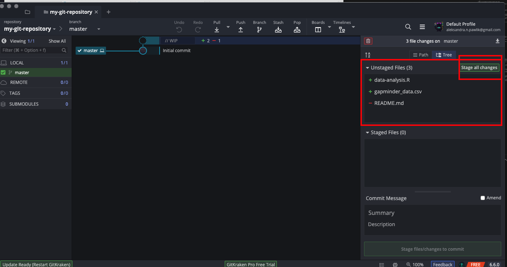

Start with creating a Git repository on your local machine. Launch GitKraken and select `Start a local repo`


Give your repository a name and select where you want to have it on your machine. A repository is in fact a directory on a hard drive (with some special features that make it a repository) so think about it as creating a directory where you will store your project files. Don't create any `.gitignore` file or a `License`. 


GitKraken by default creates a `README.md` file inside your repository. We will not need it, so when you right click on it you can remove it.


Now we can start working with our code. Inside the repository (so the directory you just set up) create a file with the code you want to work on. In this tutorial we use a simple R script. If you run it, it should download a small `csv` file with some data about world population, countries GDP etc.:

```{r}
# Short R script adapted from Software Carpentry data lesson 
library("ggplot2")

download.file("https://raw.githubusercontent.com/swcarpentry/r-novice-gapminder/master/data/gapminder_data.csv", destfile = "gapminder_data.csv")
gapminder <- read.csv("gapminder_data.csv", header=TRUE)

summary(gapminder$country)
head(gapminder)

```

In GitKraken version control will see the R script file and the `csv` file (if you run the R code and downloaded it). We will need to decide what to do with these files. Note that by default Git does not keep all files in the repository under version control. It's up to the user to decide and let Git know which files to track and manage.



In order to tell Git that we want to keep the files under version control, we need to **Stage** them by clicking `Stage all changes` in GitKraken. The files should now show up in the `Staged files` section on the right. We need to now **Commit** them. Commit takes the snapshot of the version of the files as they are in the staged state. In GitKraken you need to enter a commit message in the right hand bottom corner. 


**Commit messages**
<br>
Commit messages are important information for your future self and for any collaborators you may have. The commit message allows you to note not only what you changed (that will be captured for you by Git anyways) but *why* you did it. Commit messages have a subject like (bit like email) and then body of the message - if you want to include more detail.


We can carry on working on our R script. Since we already have the data file, we can remote the line that downloads it and add some code to inspect the data.

```{r}
# Short R script adapted from Software Carpentry data lesson 
library("ggplot2")

gapminder <- read.csv("gapminder_data.csv", header=TRUE)

summary(gapminder$country)
head(gapminder)

#Find countries where life expectancy is below the average.
below_average <- gapminder$lifeExp < 70.5

#Now add this as a column
cbind(gapminder, below_average)

```

To save this version, we need to repeat the steps of committing the file. Git tracks R script now but again it is up to us to decide whether and when we want to take the snapshot of the version of the file. To make a commit we need to do the same steps: *stage* the file and then *commit* it.


Let's add some more files to our project. Perhaps a handy 'scrapbook' file with notes, bits of code, `my-R-notes.R`.

```
#Just some bits and pieces of code that I find online and copy paste here. May be useful.

#What to do after adding the column to the data

# Check if it worked
head(cbind(gapminder, below_average))

#Tring to understand how `cbind` works
below_average <- c(TRUE, TRUE, TRUE, TRUE, TRUE)
head(cbind(gapminder, below_average))

#Umm, this failed...I need to fix it.
nrow(gapminder)

nrow(below_average)
typeof(below_average)

#Maybe this 
length(below_average)

```

## Ignoring files

In GitKraken Git will see this new `my-R-notes.R` file and ask what to do with it. However, perhaps we don't want this file with notes under version control. Maybe we will use it for writing down some passwords (generally bad practice! but let's forget that for the purpose of this training). We can tell Git to ignore this file. It will still be in our repository but Git will stop asking us what to do with it. 

To make Git ignore `my-R-notes.R` in GitKraken right click on the file and you should see submenu where you can select `Ignore`:


This action will create a file `.gitignore` in the repository. `.gitignore` will keep information about all files you want Git to ignore. It's a simple text file and so if you decide at any point that you would like Git to start tracking a file you had made it ignore, you can simply edit `.gitignore` and remove the name/path to that file.

## Checking out older versions

How can we use version control to see previous versions of our files? For example, it would be handy if we could look up that line of code which we deleted from the original script, the line that was downloading the `csv` file to our drive.

In GitKraken, in the middle, you can see our commit tree built of the commit messages. We can checkout one of those previous commits that still has the piece of code we are interested in (that is why good commit messages are so important!). When you right click on the commit (version) you are interested in, you can select `Checkout this commit`.


We are now back to the version from the commit we selected (note that this is also the version of the files which your operating system will see). We can open our R script and look up the parts of code that we since have deleted. 


**Note** When you checkout one of the previous versions from your Git commit history, you should not just start working from there editing files, making commits etc. It is possible to do that but it does require a few more steps to do it correctly which is beyond the scope of this tutorial. Think about it this way: in all movies when the main characters travel back in time and change things in hope to make the future better, it always backfires. It is somewhat similar with Git.

Once we have looked up the code, we are ready to return to the latest version of the code we were working on - to the "top" of our commit tree. In order to do that, rightclick on the commit tree and select `Checkout master`. And we're back at the latest version!


