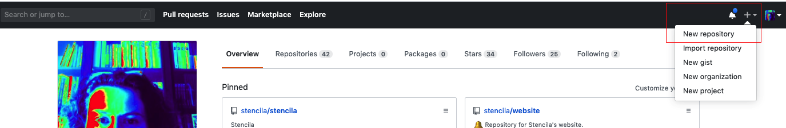
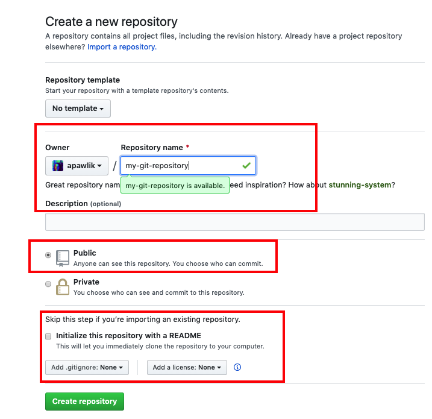
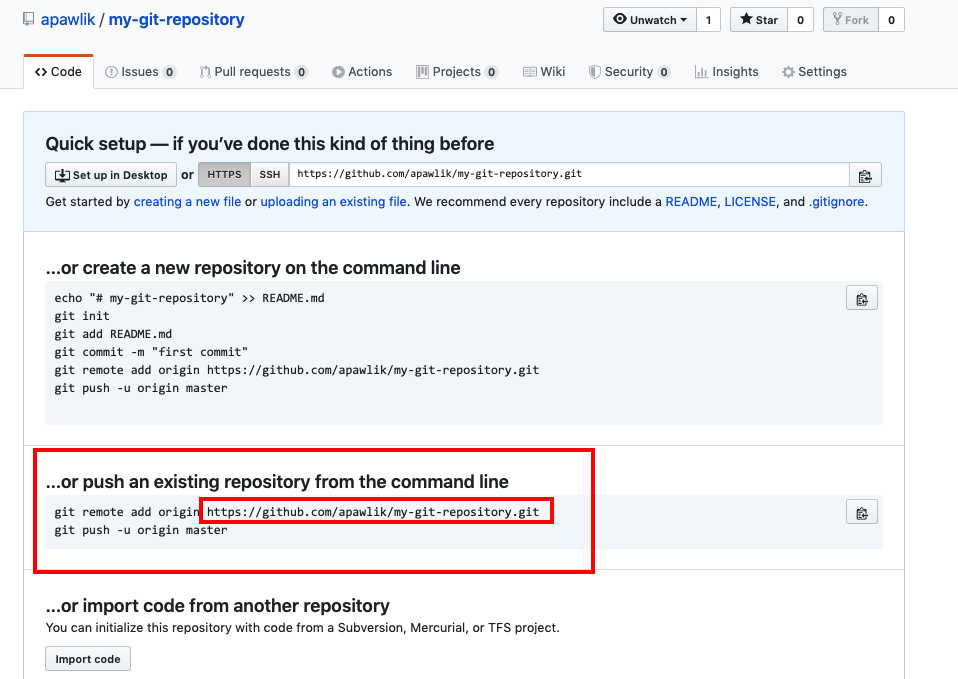
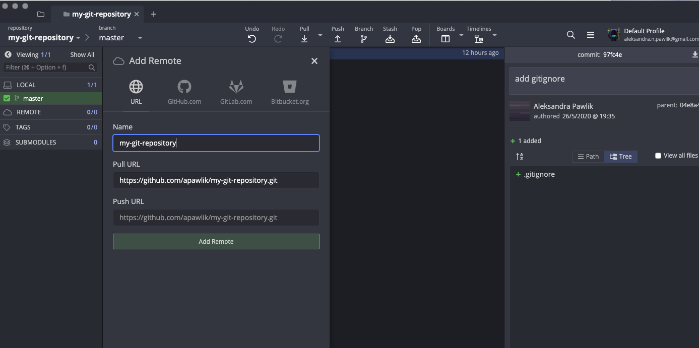
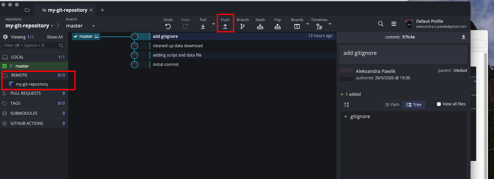
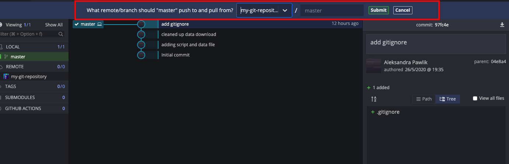
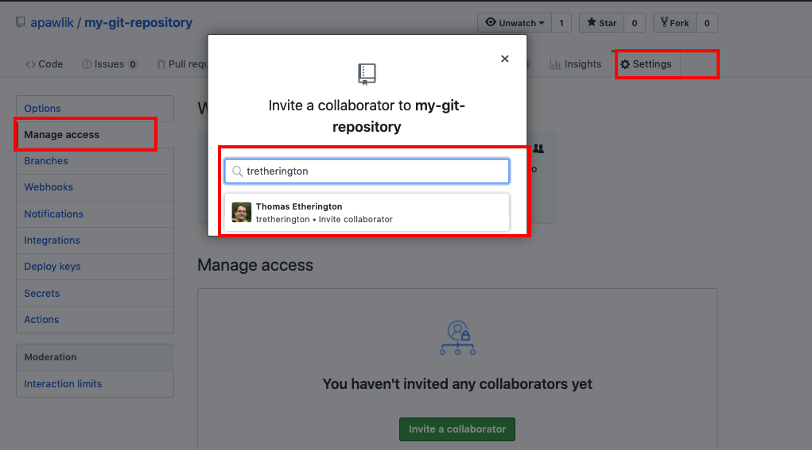

Having a local repository is useful to track changes and version your work but it also means that you only can work on it from this one machine and makes it hard to collaborate. Good news is that you don't need to email around the files or keep them in a cloud storage. There are online resources that support working with Git.

One of them is [GitHub](https://github.com) and in this section of the tutorial we will learn how to use it for your work. GitHub is widely used by open source and commercial projects (including the mammooth companies such as Microsoft or Apple). GitHub is also popular among researchers who decide to publish their code or even publish their data. Note that Manaaki Whenua Landcare Research has am [organisational account](https://github.com/manaakiwhenua/) where you can store your repositories.

Having a repository on GitHub doesn't mean that its contents will be publicly available. You can set each repository to be either public or private (in which case only logged in GitHub users that you allow access to your repository will be able to see the contents).

## Starting with GitHub

If you don't have an account yet, please set up one with [GitHub](https://github.com). It's free and takes less than a minute. We want to make our repository, that we worked on in the first part of the tutorial, available on GitHub. We need first to create an empty repository on GitHub where we will *push* our local repository.

Now you can name your repository and decide about other settings. The name doesn't have to be the same as the name of your local repository but it's good practice to keep them consistent.

Once you have done that, GitHub will give you a few hints what to do next. These hints are referring to using Git via command line but since we use GitKraken, it will be slightly different for us. Copy the line as marked on the image below (`https://github.com/apawlik/my-git-repository.git` - it will be different of course with **your** username)

Now we need to go back to our local repository on GitKraken and tell GitKraken where is our remote repository:

Then we can push the whole local repository to GitHub:

You need to log into GitHub:

## Collaborating in GihHub

Now you should see your repository in GitHub. Let's say you want to collaborate now on your code. Let's add an collaborator.

