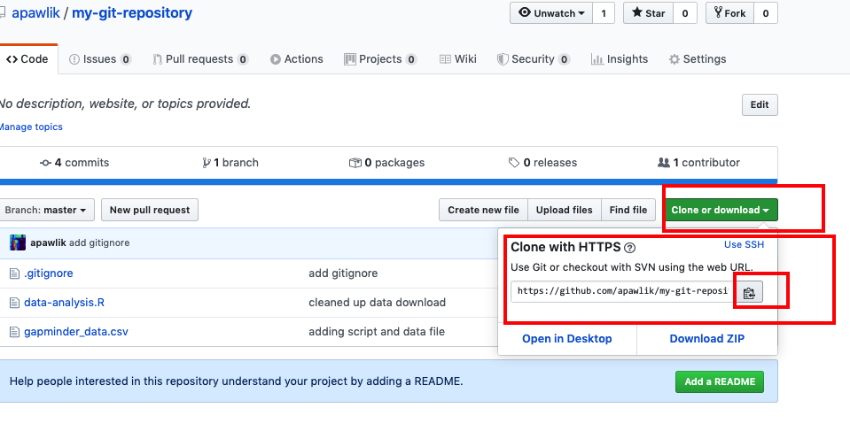
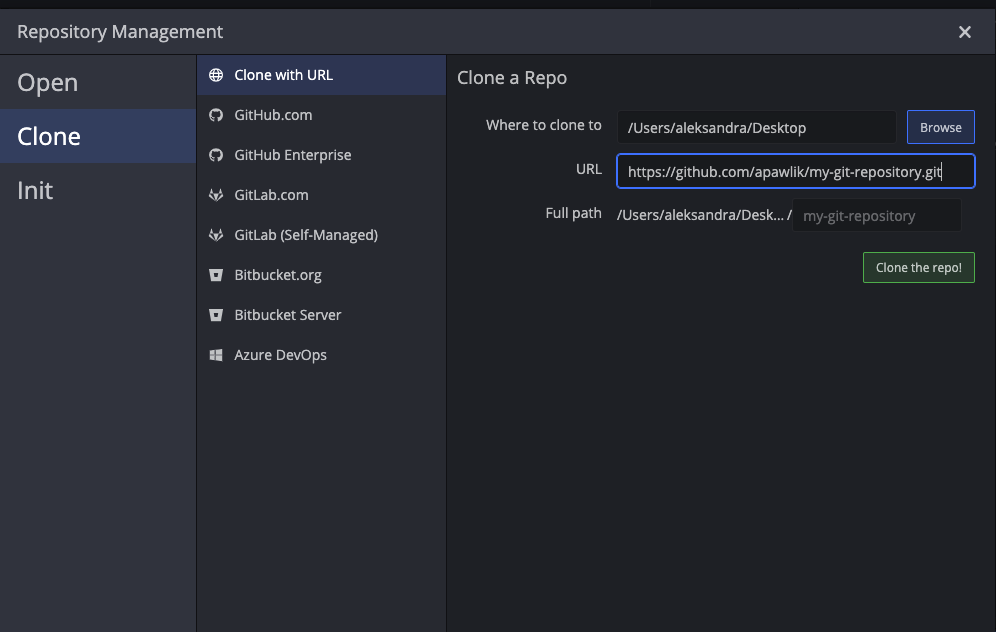
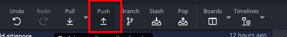
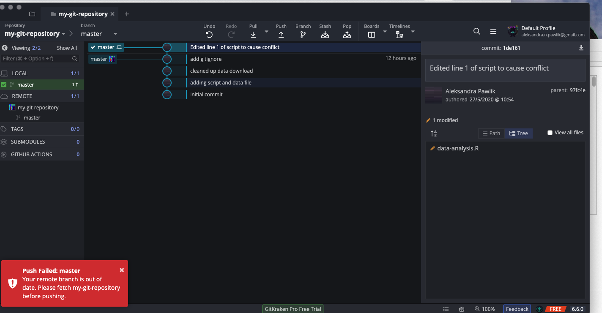
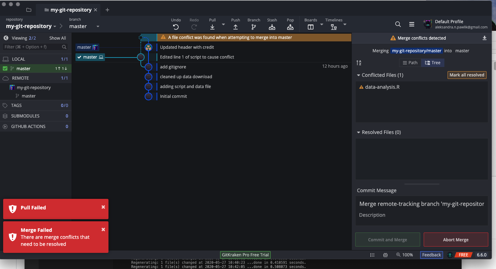
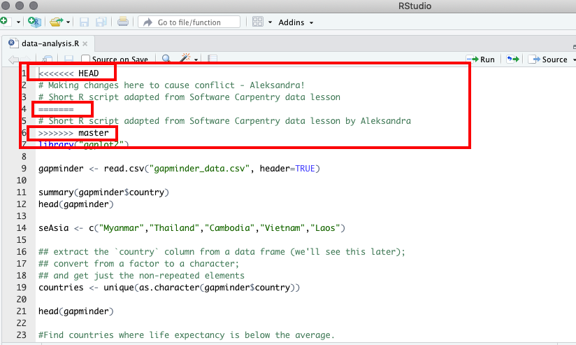
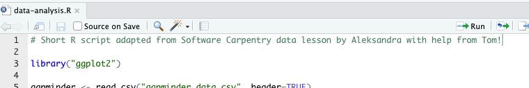
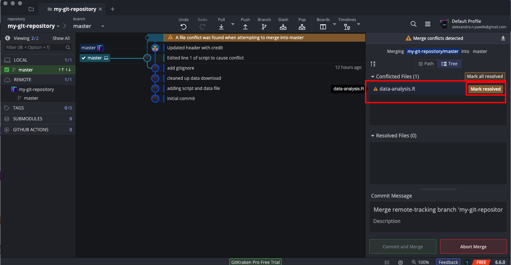
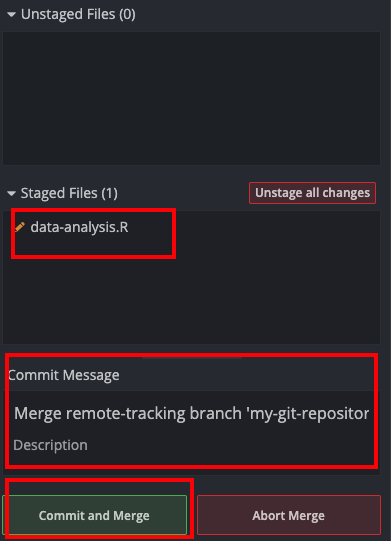

Having a local repository is useful to track changes and version your work but it also means that you only can work on it from this one machine and makes it hard to collaborate. Good news is that you don't need to email around the files or keep them in a cloud storage. There are online resources that support working with Git.

One of them is [GitHub](https://github.com) and in this section of the tutorial we will learn how to use it for your work. GitHub is widely used by open source and commercial projects (including the mammooth companies such as Microsoft or Apple). GitHub is also popular among researchers who decide to publish their code or even publish their data. Note that Manaaki Whenua Landcare Research has am [organisational account](https://github.com/manaakiwhenua/) where you can store your repositories.

Having a repository on GitHub doesn't mean that its contents will be publicly available. You can set each repository to be either public or private (in which case only logged in GitHub users that you allow access to your repository will be able to see the contents).

## Starting with GitHub

If you don't have an account yet, please set up one with [GitHub](https://github.com). It's free and takes less than a minute. We want to make our repository, that we worked on in the first part of the tutorial, available on GitHub. We need first to create an empty repository on GitHub where we will *push* our local repository.

Now you can name your repository and decide about other settings. The name doesn't have to be the same as the name of your local repository but it's good practice to keep them consistent.

Once you have done that, GitHub will give you a few hints what to do next. These hints are referring to using Git via command line but since we use GitKraken, it will be slightly different for us. Copy the line as marked on the image below (`https://github.com/apawlik/my-git-repository.git` - it will be different of course with **your** username)

Now we need to go back to our local repository on GitKraken and tell GitKraken where is our remote repository:

Then we can push the whole local repository to GitHub:

You need to log into GitHub:

## Collaborating in GihHub

Now you should see your repository in GitHub. Let's say you want to collaborate now on your code. Let's add an collaborator - ideally find a colleague that would work  with you on this task for practice.

Your collaborator should now receive an email or notification on GitHub that they were invited to collaborate on your repository. They can clone the repository to their machine. They need to find the address for cloning:

If they use GitKraken, they can get your repository locally on their machine by selecting `File -> Clone repository` in GitKraken and then providing the address of the repository:

We said earlier that version control is really good to help collaborate on the same pieces of file preventing collaborators from accidental overwrites. Let's see how that works.

Both you and your collaborator now edit on your machines (so your own copies of the files) the same section of the same file. This could be the first line of the `R` script. Each one of you should make changes that are different. Both of you make the commit like we did in the first part of this tutorial. Ask your collaborator to now push his repository to GitHub. This will update the GitHub repository with their changes.

Now you try `Push`. You should get a message that you need to first pull as there are some new updates from your collaborator. When you `Pull`, GitKraken will tell you, that push failed as there are some updates in the remote repository which you don't yet have. You need to pull first.

We do the `Pull` but we now have a conflict as both us and our collaborator edited the same file in the same place (line).

## Resolving conflicts

In a case of conflict, Git will not simply overwrite one version of the file over another. The user needs to manually indicate that the conflict is resolved. But first of all, what does actually happen inside the conflicted file? Let's open it in `RStudio`

Git attempted to `merge` two versions of file but since the same line had different content, it put them one under another separating them with Git-specific markings `<<<<<< HEAD` `============` `>>>>>>> master` indicating which one is ours (`HEAD`) and which came from pulling from the remote repository (`master`).

After talking to our collaborator, we agree on the final version and edit the file.

Now we need to tell GitKraken (and Git) that we resolved the conflict and we can commit the resolved changes.

The commit message is already entered for us. We can add more details if we want though, and then make a commit.

That's it! We should now be able to push. Our collaborators, when they pull into their local repository should see those changes.

## Going forward

